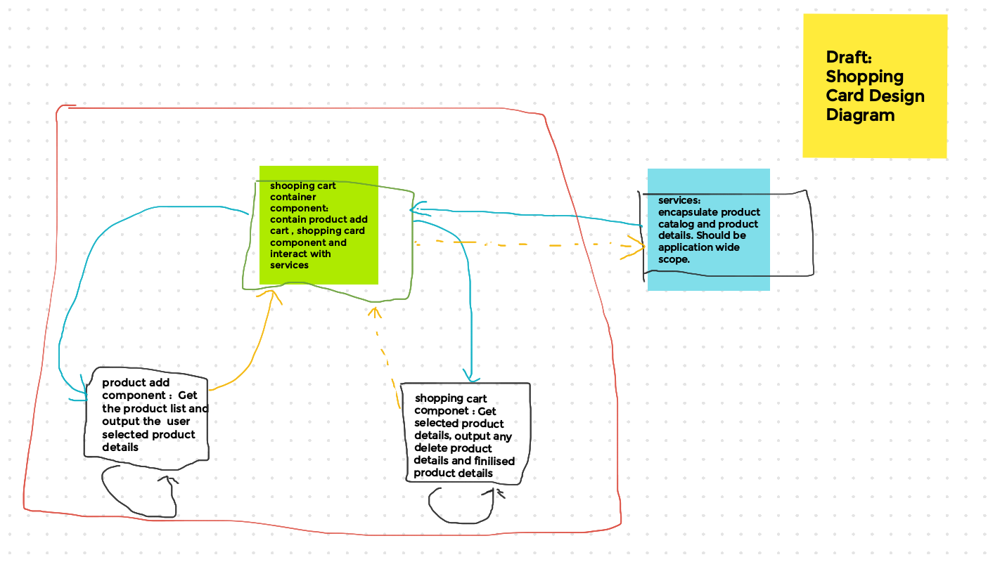

# Design Details [amp-front-end-test-ts]

This document capture the initial app design choices and address the app scope.

## UI Details & Functionality  

### UI Design 
*   Response Layout (Web & Mobile)
    *  Consider Flexbox
    *  Outer container and inside two widget side by side
    
 **Note:** In mobile screen: Shopping cart is on top. Right widget come to top. Consider flex wrap reverse / direction reverse. Check float vs flexbox
  
####  Components
*   Shopping Cart (Table Layout)
    *   Properties  
        *   Name
        *   Quantity 
        *   Price
        *   Total
    *   Functions
        *   Delete product details 
            *   Change should reflect in total
            *   Available number of product list updated ( ? May be Out of Scope?)   
        *   Table column sorting
            *  Server level or Client level sorting
            
*   Product Catalog   
    *   Properties  
        *   Name [drop down /selection list] 
            * Consider list sorting [ Default server side sorting by name]
            * Filer - Client side filter/ Server side depends number records ???
        *   Quantity [Number input]
        *   Price  - Reflected based on product selection. 
            *   Does reflect the total price ( product price * Quantity) [Assume single product price].
    *   Add
        *   Add / Update shopping card
        *   Update available number of product ( ? May be Out of Scope?)
    *   Cancel
        * Reset to default /initial state.

##  Model
    *   Product
        *   id
        *   name
        *   price
            *  How to represent the $? formatCurrency or Currancy Pipe for localisation 
    *   CardItem 
        *   id
        *   Product / product_id ??? 
        *   quantity
        *   total price ??? [Can be dynamically calculated]

## Services
*   ProductCatalog Service
    *   Application Scope can be in core module
    
*   ShoppingCard Service
    *      
*   AppErrorMessageService
    *   Just to pass the error message and display in top ???
             
## Modules
*   CoreModule
    *   Anything used application wide
    *   Application wide singleton services
    
*   Feature Module
    *   HomeModule - Contains shopping card components
        
*   Shared Module /  UIComponent Modules
    *   Any pipe or declare components re-used and referenced by the components declared in other feature modules

## Performance Consideration 
*   *ngFor directive with trackBy option
*   Pure pipes
*   Less elements in dom [use ng-container]
*   Use Onpush change detection
*   Store management with ngrx    

# References

*   [Responsive Web Design - Media Queries](https://www.w3schools.com/css/css_rwd_mediaqueries.asp)
*   [align two divs side by side with floating (responsive)](https://stackoverflow.com/questions/45020506/align-two-divs-side-by-side-with-floating-responsive)
*   [Two Divs next to each other, that then stack with responsive change](https://stackoverflow.com/questions/14436800/two-divs-next-to-each-other-that-then-stack-with-responsive-change)
